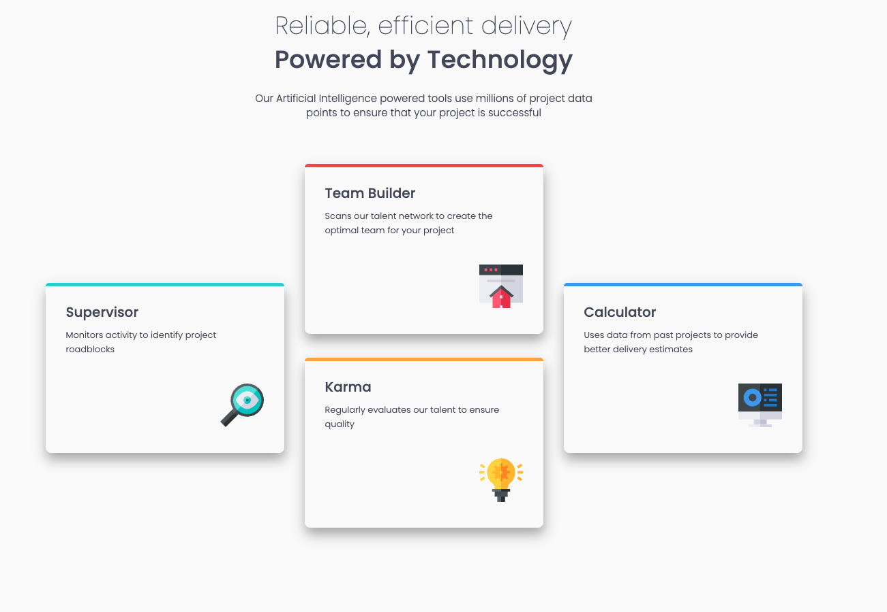
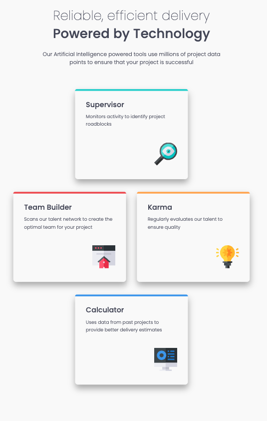
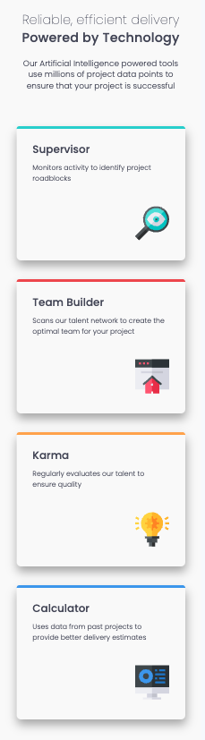

# Four Card Feature Section – Responsive UI Project

This project is a responsive front-end implementation of the **Four Card Feature Section**, originally designed by [Frontend Mentor](https://www.frontendmentor.io/challenges/four-card-feature-section-weK1eFYK). Reimagined and built by **Elizabeth Parnell**, this implementation showcases modern web development practices using **Next.js**, **React**, **TypeScript**, and **CSS Modules**.

---

## 🖥️ Live Demo

- 🔗 [Live Site](https://bp-four-card-feature-section.netlify.app/)
- 💻 [Code Repository](https://github.com/ejparnell/four-card-feature-section)

---

## 🧰 Tech Stack

- **Next.js** – Server-rendered React framework for optimized performance
- **React** – Component-based UI library
- **TypeScript** – Type-safe JavaScript for robust development
- **CSS Modules** – Scoped styling to ensure maintainability and clarity
- **Mobile-first Design** – Layout adapts fluidly to all screen sizes

---

## 📸 Preview





---

## 📐 Features

- Responsive layout using Flexbox and CSS Grid
- Clean, semantic HTML for accessibility and SEO
- Fully mobile-first with breakpoints for desktop experience
- Modular component structure with reusable styles
- Implements consistent design patterns for spacing and typography

---

## 💡 Highlights & Learnings

This project gave me the opportunity to:

- Apply **CSS Grid** in a real-world UI layout
- Practice **mobile-first design** principles from scratch
- Improve my workflow with **TypeScript** in a static site context
- Reinforce best practices around **component-based architecture** and file structure with Next.js

---

## 🚧 Areas for Future Iteration

- Add light/dark mode support using CSS variables
- Animate card hover states for enhanced interactivity
- Implement accessibility audits using tools like Lighthouse and Axe

---

## 📚 Resources & Credits

- [Frontend Mentor Challenge](https://www.frontendmentor.io/challenges/four-card-feature-section-weK1eFYK) – Original mockup and layout specs
- [CSS Tricks - A Complete Guide to Grid](https://css-tricks.com/snippets/css/complete-guide-grid/)
- [MDN Web Docs](https://developer.mozilla.org/en-US/) – Reference for web standards

---

## 👩‍💻 About the Developer

**Elizabeth Parnell**  
Software Engineer | Frontend Specialist | UX Enthusiast

- 🌐 [Portfolio](https://eparnell.me)
- 🧑‍💼 [LinkedIn](https://www.linkedin.com/in/elizabethjparnell/)
- 💻 [GitHub](https://github.com/ejparnell)
- 📝 [Frontend Mentor Profile](https://www.frontendmentor.io/profile/ejparnell)

---

## 🏁 Getting Started Locally

```bash
git clone https://github.com/ejparnell/four-card-feature-section.git
cd four-card-feature-section
npm install
npm run dev
```

Then open your browser and navigate to `http://localhost:3000`.

## 📜 License

This project is open-source and available under the [MIT License](https://opensource.org/license/mit/). Original design and assets are property of [Frontend Mentor](https://www.frontendmentor.io/).
